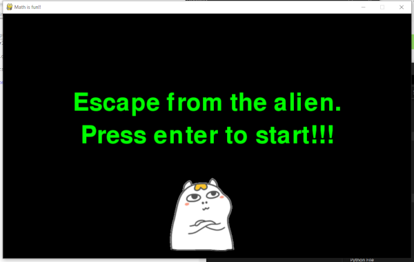
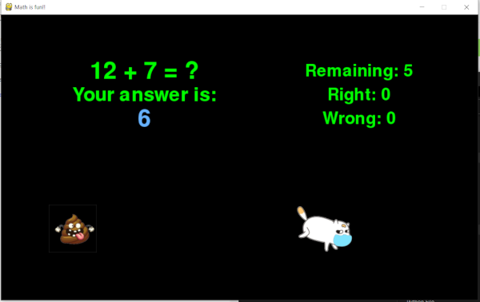
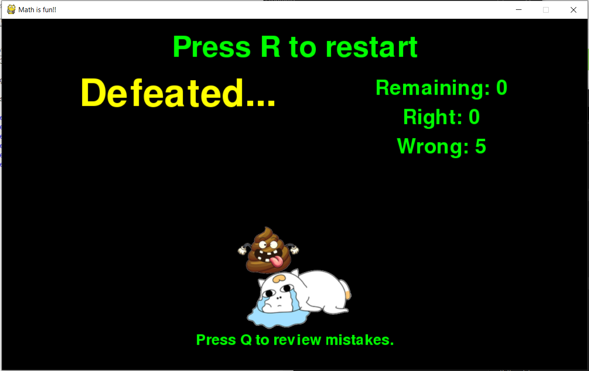
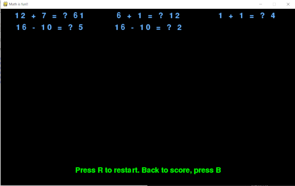

# simple_math
 A simple math pygame for my boy.  
 Rescue the cat from the poop alien by answering math questions. :)  
 Right now, the questions are only addition and subtraction. You can change them to other types of questions in the code. Developed in python 3.6.8 and pygame 1.9.6.  
 
   
   
   
 Review mistakes.  
   
 Acknowledgments: Some codes were learned from TechWithTim's pygame tutorial (https://techwithtim.net/). Huge thanks to him for making great tutorials! The cat pictures are from 小刘鸭_刘阿圆 (lwj1005@qq.com, if you are mad at me for using your art, please contact me. I will take them down...). Other pictures are from google... In memory of 2020, as such a special year, I added a mask to the cat.  

